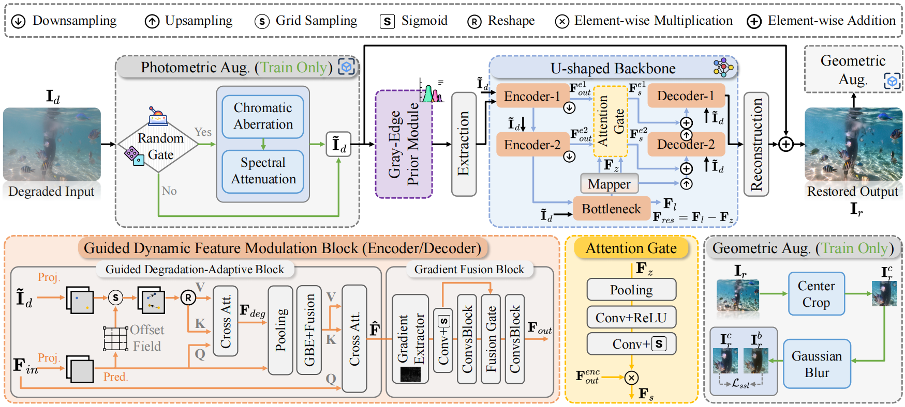

<div align="center">

# 🌊 From Degradation Guidance to Latent Purification: A Unified Network for Underwater Image Restoration

[](https://arxiv.org/)
[](LICENSE)
[](https://www.python.org/)
[](https://pytorch.org/)

</div>

---


This is the official PyTorch codes for the paper:

>**From Degradation Guidance to Latent Purification: A Unified Network for Underwater Image Restoration**<br>  [Xu Zhang<sup>1</sup>](https://house-yuyu.github.io/), [Xuhui Cao<sup>1</sup>](), [Kangzhe Yuan<sup>1</sup>](), [Laibin Chang<sup>1</sup>](), [Huan Zhang<sup>2</sup>](), [Lefei Zhang<sup>1📧</sup>](https://scholar.google.com.hk/citations?user=BLKHwNwAAAAJ&hl=zh-CN)<br>
> <sup>1</sup>Wuhan University, <sup>2</sup>Guangdong University of Technology<br>
> <sup>📧</sup>Corresponding author.




:star: If PROTEUS is helpful to your images or projects, please help star this repo. Thank you! :point_left:


## Table of Contents
- [Environment](#environment)
- [Datasets](#数据集--datasets)
- [Dataset Structure](#数据集目录结构--dataset-structure)
- [Quick Start](#快速开始--quick-start)
---
## Environment
### 安装步骤
1. **克隆仓库**
   ```bash
   git clone https://github.com/House-yuyu/PROTEUS.git
   cd PROTEUS
   ```
2. **创建虚拟环境（推荐）**
   ```bash
   conda create -n PROTEUS python=3.10 -y
   conda activate PROTEUS
   ```
3. **安装其余依赖**
   ```bash
   pip install -r requirements.txt
   ```
### 主要依赖库
```
torch>=1.10.0
torchvision>=0.11.0
numpy>=1.21.0
opencv-python>=4.5.0
Pillow>=8.0.0
scikit-image>=0.18.0
matplotlib>=3.4.0
tqdm>=4.62.0
tensorboard>=2.7.0
PyYAML>=5.4.0
```
---
## Datasets
本项目支持以下常用低光照图像增强数据集：
### 1. LOL Dataset
- **来源**: [Retinex-Net (Wei et al., BMVC 2018)](https://daooshee.github.io/BMVC2018website/)
- **训练集**: 485 对图像
- **测试集**: 15 对图像
- **图像分辨率**: 400×600
- **下载地址**: [Google Drive](https://drive.google.com/file/d/157bjO1_cFoSJ2IaUNnEkBDsXUOXajUTa/view)
### 2. VE-LOL Dataset
- **来源**: [From Noise to Signal (Liu et al., IJCV 2021)](https://flyywh.github.io/IJCV2021LowLight_VELOL/)
- **合成训练集**: 2,500 对图像
- **真实测试集**: 100 张图像
### 3. MIT-Adobe FiveK Dataset
- **来源**: [MIT-Adobe FiveK (Bychkovsky et al., CVPR 2011)](https://data.csail.mit.edu/graphics/fivek/)
- **图像数量**: 5,000 张（训练 4,500 / 测试 500）
### 4. LSRW Dataset
- **来源**: [LSRW (Hai et al., ACM MM 2023)](https://github.com/JianghaiSCU/R2RNet)
- **图像数量**: 5,650 对（训练 5,200 / 测试 450）
---
## Dataset Structure
请将数据集下载后按如下目录结构组织：
```
LLIEmm/
├── data/
│   ├── LOL/
│   │   ├── train/
│   │   │   ├── low/          # 低光照输入图像 (485 张)
│   │   │   │   ├── 1.png
│   │   │   │   ├── 2.png
│   │   │   │   └── ...
│   │   │   └── high/         # 对应正常光照参考图像 (485 张)
│   │   │       ├── 1.png
│   │   │       ├── 2.png
│   │   │       └── ...
│   │   └── test/
│   │       ├── low/          # 低光照测试图像 (15 张)
│   │       │   ├── 1.png
│   │       │   └── ...
│   │       └── high/         # 参考图像 (15 张)
│   │           ├── 1.png
│   │           └── ...
│   │
│   ├── VE-LOL/
│   │   ├── train/
│   │   │   ├── low/
│   │   │   └── high/
│   │   └── test/
│   │       ├── low/
│   │       └── high/
│   │
│   ├── FiveK/
│   │   ├── train/
│   │   │   ├── input/        # 原始低曝光图像
│   │   │   └── expert_C/     # Expert C 精修图像（常用参考）
│   │   └── test/
│   │       ├── input/
│   │       └── expert_C/
│   │
│   └── LSRW/
│       ├── train/
│       │   ├── low/
│       │   └── high/
│       └── test/
│           ├── low/
│           └── high/
│
├── models/                   # 模型定义
├── utils/                    # 工具函数
├── configs/                  # 配置文件
├── train.py                  # 训练脚本
├── test.py                   # 测试脚本
├── requirements.txt          # Python 依赖
└── README.md
```
---
## Quick Start
### 训练
```bash
python train.py --config configs/lol.yaml --dataset LOL --data_root data/LOL
```
### 测试
```bash
python test.py --config configs/lol.yaml --checkpoint checkpoints/best_model.pth \
               --input data/LOL/test/low --output results/
```


## Acknowledgements

---

## Contact

If you have any questions, please feel free to reach us out at <a href="zhangx0802@whu.edu.cn">zhangx0802@whu.edu.cn</a>.
